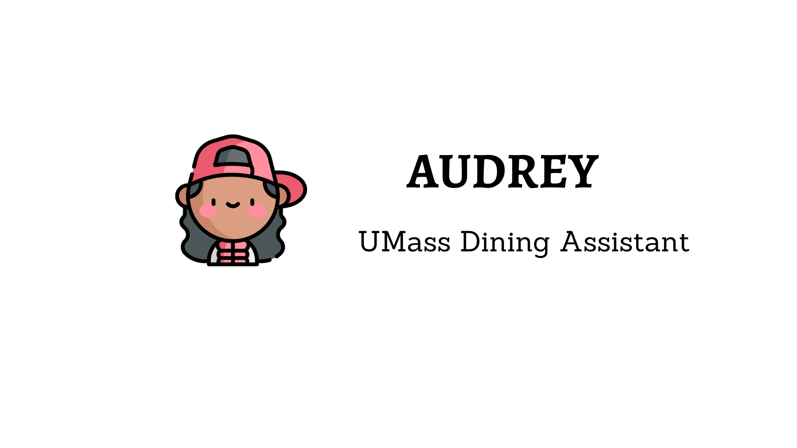

# Audrey: UMass Dining Assistant



This project is built as a part of Hack(H)er413 at UMass Amherst.

Audrey is UMass's own chatbot for all dining halls. It can intelligently recommend you dishes to eat based on your dietary restrictions (and mood) from what's being served at any of the four dining halls right now! Audrey loves tofu, ask her to write a poem on it : P

## Inspiration

UMass has continuously been the #1 in dining across the US. The variety of dishes offered at a single dining hall are so overwhelming. Combine that with the fact that there are multiple dining halls and deciding what to eat becomes a herculean task in itself. You're bound to overlook any new or unique items being offered. Unless you like people lining up behind you, reading each ingredient on the dish label to decide whether to take a portion is not possible.

Even though UMass Dining has an app of it's own, it doesn't offer a good user experience and has multiple negative reviews. What if people could not only see what's being served at a dining hall but also get food recommendations from among the zillion dishes being served? What if you never have to look at dish labels ever again? What if all your dietary restrictions are considered including your mood?

Audrey is your personal assistant for all dining halls. Just ask her what to eat and she'll create a complete lunch combination for you including sides, mains and desserts.

## What it does

Audrey is an acronym for Assistant for UMass Dining Recommendations and Eats for You.

Audrey is a chatbot that can fetch what dishes are being served at UMass the four UMass dining halls - Berkshire, Franklin, Hampshire and Worcester and using artificial intelligence to predict what dishes you should eat. Audrey can factor in dietary restrictions, special ingredients you need, time of the day and even your mood!

Users can even specify if they prefer a particular dining hall over the other and Audrey will recommend you dishes to eat from that dining hall.

Audrey is a 10 year old girl who loves chocolates and tofu. Feel free to ask her any question about herself, what dishes she likes or what she does if she's bored.

## Development

- Create a `.env` file in the backend folder.

```bash
cd backend
touch .env
```

- Add OpenAI key as an environment variable, `OPENAI_API_KEY`.
- Start the backend using `flask run`.
- Start the frontend React app using `npm start`.
- Enter any query.

## Fetching Data

Data will need to be fetched periodically until an async cron job is designed. Making a GET request to the `/data` endpoint with query-params specifying the dining hall will scrape and save the data.

```bash
curl http://localhost:5000/data?dining=worcester
```

<h5 align="center">

Made with ❤️ by Rohan Lekhwani
</h5>
